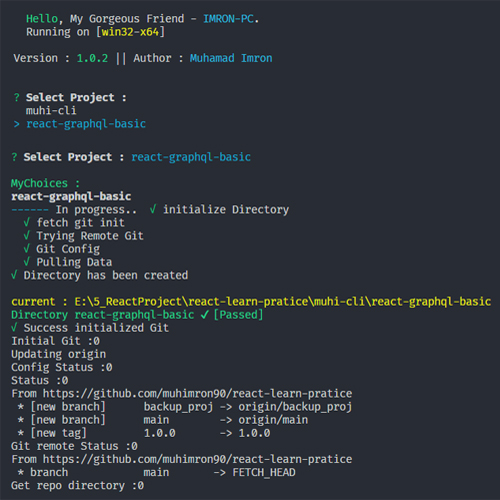

# react-learn-practice

### Documentations

##### Prerequisites :

- node >= 10
- npm > 6.0.x
- git

##### Clone Repo :

```
git clone https://github.com/muhimron90/react-learn-pratice.git
```

---

##### Clone Specific Project :

##### Installing

```
npm i -g muhi-cli || npx muhi-cli
```

###### Prompt :


