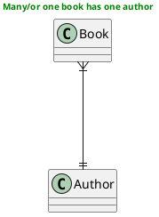

why many books is only have one author?
but dont you ever think these book in general paradigm.

The book of Aliens-World has been written by Mr.Jhon doe(Author).
otherwise, Mr. Jhon Doe can write any books his like too or he can release The book of Aliens-World Edition 2.

> Summary, The books of Aliens-World and Aliens-World Edition 2 is written by Mr. JhonDoe it self. Many Books can be written by One Author but is possible one Book had Many Authors (not as team) ?
> If the other books with same genre or title but different Author, the answer is Absolutely Yes
